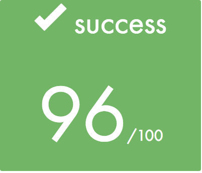
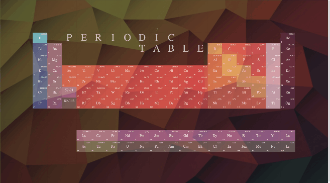

# PHP 

## Day 00

*ex00 -> Basic or home ->		basics.html  
*ex01 -> Mendeleiev ->			mendeleiev.html  
*ex02 -> Day of the 43 ->		doft.html doft.css resources/  
*ex03 -> The shrunk agent ->	responsive.html responsive.css  
*ex04 -> SNCF Sandwich ->		menu.html menu.css  
*ex05 -> SCUMM	->				-n/a-  

## Day01

